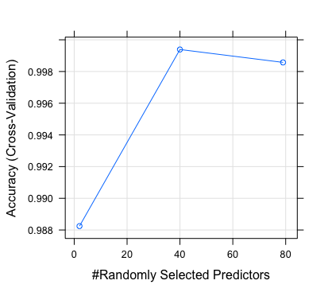

```{r setup, include=FALSE}
knitr::opts_chunk$set(echo = TRUE)
```

The goal of this reearch is to create the supervised model which is able predict the manner in which the participants of the research did the exercise. The date includes 19622 records which split to training set and test set, 75% and 25% accordingly. The data was cleaned where 102 columns with missing data were removed, what means that 58 features left after cleaning. The selected model was random forest where all features were used. The training of the model was done via cross validation with 5 folds what allow to reduce overfitting. The number of folds was chosen not too big in order to keep the less biased error estimation. The accuracy of the model was optimal, 0.999,  with 40 predictors as presented in model output and image below. The same accuracy received on test set, 0.998, which means that the model is stable and no overfitting problem in model. On out of sample test set I expect to receive the same accurecy. I uset random forest model for this problem because it is one of the many multiclass classifiers. It provided good results from the beginning and I decided not to check other models such as logistic resrgession, support vector maching, neural networ or enseble of them. As expected, the prediction on out of sample data provided acuraccy of 1.0. 


### The model train output
```{r cars, echo=FALSE}
cat("
Random Forest 

14718 samples
   57 predictor
    5 classes: A, B, C, D, E

No pre-processing
Resampling: Cross-Validated (5 fold) 
Summary of sample sizes: 11775, 11775, 11774, 11775, 11773 
Resampling results across tuning parameters:

  mtry  Accuracy   Kappa    
   2    0.9882459  0.9851289
  40    0.9993885  0.9992266
  79    0.9985733  0.9981955

Accuracy was used to select the optimal model
 using  the largest value.
The final value used for the model was mtry = 40. 
")
```

### Predictors selection

